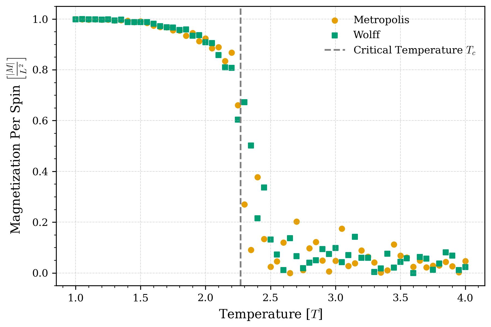

# 2D Ising Model Monte Carlo Simulation

## Overview
A C++ implementation of the two-dimensional Ising model using both the Metropolis-Hastings and Wolff cluster algorithms. The project investigates magnetic phase transitions, critical phenomena, and the reduction of critical slowing down through cluster Monte Carlo methods.

<table align="center">
  <tr>
    <th align="center">Metropolis-Hastings</th>
    <th align="center">Wolff Cluster Algorithm</th>
  </tr>
  <tr>
    <td align="center">
      
    </td>
    <td align="center">
      
    </td>
  </tr>
</table>

<p align="center">
<b>Figure 1.</b> Equilibrium dynamics of a 100 × 100 two-dimensional Ising model at the critical temperature (<i>T</i> = 2.269). Frames are recorded after the equilibration (warmup) phase. The Metropolis-Hastings algorithm (left) performs single-spin updates, resulting in slow domain evolution, while the Wolff algorithm (right) flips correlated spin clusters, rapidly exploring configuration space and mitigating critical slowing down.
</p>


## Physics Background
The 2D Ising model is a classic statistical model used to simulate phase transitions and ferromagnetism in magnetic materials. The system consists of a discrete $L \times L$ lattice with a spin variable, $\sigma_k \in \{-1,+1\}$, assigned to each lattice site, $s_k$.

In the abscence of an external magnetic field, the system's energy is described by the Hamiltonian function $H(\sigma)=-J\sum\limits_{\langle i,j \rangle}s_is_j$.

- $J$: Coupling constant. If $J>0$, the system is ferromagnetic and the spins prefer to be aligned.
- $\langle i,j \rangle$: Represents the sum of nearest-neighbour pairs with periodic boundary conditions.

The system tends to the lowest energy state however, heat disrupts this tendancy and creates the possibility of different structural phases. The system undergoes a phase transition at the Onsager critical temperature $(T_c)$

$$
T_c = \frac{2J}{k_B\ln(1+\sqrt{2})}\approx 2.269 \frac{J}{k_B}
$$

- High Temperature $(T>T_c)$: Thermal energy dominates resulting in spins to flip rapidly and independantly.

- Critical Temperature $(T=T_c)$: The system becomes unstable trying to balance between order and chaos.

- Low Temperature $(T<T_c)$: Magnetic interaction energy dominates resulting in spins to align globally and minimizing energy.


## Algorithms
### Metropolis-Hasting:

The Metropolis-Hasting algorithm is the most commonly used Monte Carlo algorithm to simulate the Ising model. It utilizes single-spin-flip dynamics to change at most one spin site on the lattice in each transition. The algorithm is implemented as follows:

1. Initialize spins on a 2D square lattice in a random configuration.
2. Randomly select a spin site.
3. Calculate the change in energy $\Delta E$ associated with flipping the spin.
4. Compute the Metropolis probability, $P_{flip}=$ min $(1, e^{-\frac{\Delta E}{k_B T}})$ and compare it to a uniform random number $r \in U(0,1)$. If the condition $P_{flip}>r$ is satisfied, then flip the spin.
5. Repeat steps 2-4.

The algorithm does not perform well around the critical point $T_c$ as the spins become highly correlated, resulting in single-spin-flip dynamics becoming extremely slow. This phenomenon is referred to as "Critical Slowing Down".

### Wolff:
To resolve the effect of critical slowing down around the critical point, non-local algorithms, like the Wolff algorithm, are utilized to flip entire clusters of aligned spins. The algorithm is implemented as follows:

1. Initialize spins on a 2D square lattice in a random configuration.
2. Randomly select a spin site to become the seed of a new cluster.
3. Check neigbouring sites around the seed to identify parallel spins. 
4. If a neighbour shares the same spin direction as the seed, generate a uniform random number $r \in U(0,1)$ and add the neighbour to the cluster if it satisfies the condition $P=1-e^{-\frac{2J}{k_B T}} > r$.
5. Repeat steps 3 & 4 until no more spins can be added to the cluster. Then flip the entire cluster simultaneously.
6. Repeat steps 2-5.


## Results
### Magnetization vs. Temperature

<p align="center">
    
</p>

<p align="center">
<b>Figure 2.</b> Average absolute magnetization per spin (<i>&lt;|M|&gt;/L²</i>) as a function of temperature for a 100 × 100 two-dimensional Ising lattice simulated using the Metropolis-Hastings and Wolff cluster algorithms. Simulations were performed over the temperature range <i>T</i> = 1.0–4.0 in increments of 0.05. At each temperature, measurements were averaged over 200 Monte Carlo sweeps following an equilibration phase. The close agreement between the two curves confirms that both algorithms sample the same equilibrium distribution.
</p>

### Heat Capacity vs Temperature

### Energy or Magnetization convergence

### Autocorrelation


## Repository Structure
- `src/` - C++ implementation
- `scripts/` - python analysis and visualization scripts
- `results/`- processed figures and animations

## Building

Clone the repository

```bash
git clone ...Add
cd IsingModel
```

Create a build directory

```bash
mkdir build
cd build
```

Compile

```bash
cmake ..
cmake --build .
```

Run

```bash
./IsingModel
```


## Future Improvements


## Author
Maahir Patel